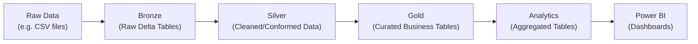

# Data Flow and Pipeline

This document describes the layered ETL (ELT) pipeline for the lakehouse architecture and provides example code snippets. The design follows the **Medallion architecture** (Bronze, Silver, Gold)【9†L235-L243】【9†L247-L254】, where data is progressively refined.



### Bronze Layer (Raw Ingestion)

- **Purpose:** Ingest raw data with minimal transformation. Preserve full data fidelity and history for auditing【9†L235-L243】.
- **Example:** Load raw CSVs of transactions.
  
```python
# Python/Spark example: Read CSV and write to Bronze Delta table
raw_df = spark.read.csv("/mnt/raw/transactions.csv", header=True, inferSchema=True)
raw_df.write.format("delta").mode("overwrite").saveAsTable("bronze.transactions_raw")
```

This might add metadata columns (e.g. `_load_datetime`). The schema matches source. The Bronze tables act as an immutable source and can be reloaded if needed.

### Silver Layer (Cleansed Data)

- **Purpose:** Cleanse and conform data. Apply data quality checks (filter nulls, correct types, deduplicate, standardize formats).
- **Example:** Filter invalid records, parse dates.
  
```sql
CREATE TABLE silver.transactions_clean AS
SELECT
  CAST(transaction_id AS STRING) AS transaction_id,
  to_date(transaction_date, 'yyyy-MM-dd') AS date,
  amount,
  client_id,
  merchant_id
FROM bronze.transactions_raw
WHERE transaction_date IS NOT NULL
  AND amount > 0;
```

Here we perform “just-enough” transformations【9†L247-L254】: type casts, null checks, etc. The result is an **enterprise-wide cleaned view** of transactions. We also dedupe if necessary, and fill any dimension reference data (e.g. if separate customer files exist, we might join them here).

### Gold Layer (Curated Business Tables)

- **Purpose:** Build dimensional model tables optimized for analytics. Apply business logic, complex transformations, and pre-aggregation.
- **Examples:**
  - **Dimensional Tables:** Create dimensions for date, customers, merchants.
  
```python
# Example: create a date dimension covering the range of transactions
date_dim = spark.sql("""
SELECT DISTINCT date AS full_date
FROM silver.transactions_clean
""").withColumn("date_sk", col("full_date").cast("int"))
# Add year, month, etc.
date_dim = (date_dim
    .withColumn("year", year(col("full_date")))
    .withColumn("month", month(col("full_date")))
    .withColumn("month_name", date_format(col("full_date"), "MMMM"))
)
date_dim.write.mode("overwrite").format("delta").saveAsTable("gold.dim_date")
```

  - **Fact Table:** Assemble the fact table with foreign keys to dimensions.
  
```python
# Join cleaned transactions with dimensions
fact = (spark.table("silver.transactions_clean") 
        .join(spark.table("gold.dim_date"), "date")
        .join(spark.table("silver.clients"), "client_id")
        .join(spark.table("silver.merchants"), "merchant_id")
        .select(
            col("date_sk"),
            col("client_sk"),
            col("merchant_sk"),
            col("amount")
        )
)
fact.write.mode("overwrite").format("delta").saveAsTable("gold.fact_transactions")
```

The Gold layer may denormalize (e.g. adding category fields) to speed queries. It uses a **star-schema** style: one fact table (`fact_transactions`) connected to dimension tables (`dim_date`, `dim_client`, `dim_merchant`)【21†L231-L239】. Historically changing attributes (e.g. merchant tier) can be handled by SCD Type 2 if needed (not shown).

### Analytics Layer (Serving Tables)

- **Purpose:** Precompute aggregated datasets tailored for dashboards, minimizing computation in Power BI. These tables are in an `analytics` or `dashboard` schema.
- **Examples of tables:**
  - **Monthly Revenue Trend:** e.g. `dashboard_revenue_trend` with columns `month_date`, `total_revenue`, `transaction_count`.
  
```sql
CREATE TABLE analytics.dashboard_revenue_trend AS
SELECT
  trunc(date, 'month') AS month_date,
  SUM(amount) AS total_revenue,
  COUNT(*) AS transaction_count,
  ROUND(AVG(amount), 2) AS avg_transaction_value
FROM gold.fact_transactions
GROUP BY trunc(date, 'month')
ORDER BY month_date;
```

  - **RFM Segments:** Calculate and store RFM scores in `dashboard_rfm_segments`.
  - **Merchant Performance:** e.g. `dashboard_merchant_performance` listing top merchants by revenue.
  - **Customer Activity:** e.g. `dashboard_customer_activity` with customer recency, frequency, churn flag, etc.
  - **Additional Aggregates:** `agg_client_lifetime` (total spend per client), `agg_merchant_daily` (daily spend per merchant), etc.

These tables include the necessary granularity for reporting (for instance, using `month_date` which is the first day of each month allows Power BI to plot timelines correctly【9†L235-L243】). Analysts can directly query these lightweight tables in Power BI without needing complex joins.

---

## Next Steps

With these tables in place, the Power BI report (in `powerbi/dashboard.pbix`) connects to the Databricks SQL endpoint and consumes the analytics tables. The dashboards include KPIs and charts for revenue trends, RFM heatmaps, churn rates, and merchant rankings. See **README.md** for setup instructions on connecting Power BI to Databricks.