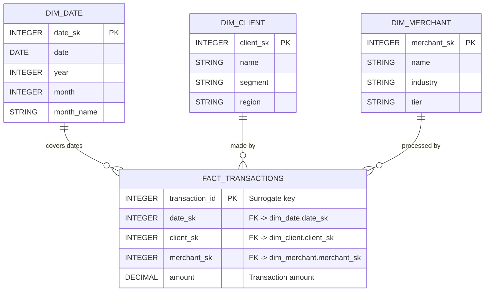

# Data Model (Star Schema)

The analytical data model follows a **star schema**: one central fact table (`fact_transactions`) connected to several dimension tables (`dim_date`, `dim_client`, `dim_merchant`, etc.)【21†L231-L239】. The fact table contains quantitative measures, and each dimension provides descriptive attributes.

### Fact Table: `fact_transactions`

- **grain:** each record is one financial transaction.
- **Key columns:** 
  - `date_sk` (FK to `dim_date`)
  - `client_sk` (FK to `dim_client`)
  - `merchant_sk` (FK to `dim_merchant`)
- **Measures:** 
  - `amount` (transaction value)
  - Other possible measures (e.g. `transaction_count` if aggregated further, etc.)

### Dimension Tables

- **`dim_date` (Date Dimension):**
  - `date_sk` (PK): integer key (e.g. YYYYMMDD or surrogate).
  - `date`: actual date (used for time intelligence).
  - `year`, `month`, `quarter`, `month_name`, etc. for hierarchies.
  - *Note:* We include an explicit date column so Power BI can build calendar hierarchies. An alternate key like `year_month_key` could be used, but using a DATE enables built-in time functions and continuous axes in BI【9†L235-L243】【9†L276-L284】.

- **`dim_client` (Customer Dimension):**
  - `client_sk` (PK): unique customer ID.
  - Attributes: `name`, `segment` (e.g. RFM segment label), `region`, etc.
  - (Could include SCD logic if client attributes change over time.)

- **`dim_merchant` (Merchant Dimension):**
  - `merchant_sk` (PK): unique merchant ID.
  - Attributes: `name`, `industry`, `tier`, `region`, etc.
  - Tracks merchant-level attributes (could use Type 2 SCD if needed for historical reporting).

Additional dimensions (e.g. product) can be added if more granular data is available, but here we focus on clients, merchants, and dates.



In this ER diagram, each dimension is on the “one” side of a one-to-many relationship to the fact table. For example, each date may have many transactions, so `dim_date ||--o{ fact_transactions`. The star schema simplifies queries by reducing joins, at the cost of some denormalization (which is acceptable for fast analytics)【21†L231-L239】.

---

### Analytical & Aggregated Tables

Beyond the core star schema, the project includes pre-aggregated tables in a separate schema (`analytics`):
- **`dashboard_revenue_trend(month_date, total_revenue, transaction_count, avg_transaction_value)`** – Monthly revenue aggregates.
- **`dashboard_rfm_segments(client_sk, recency_rank, frequency_rank, monetary_rank, rfm_segment)`** – Final RFM segments by customer.
- **`dashboard_merchant_performance(merchant_sk, total_revenue, transaction_count)`** – Top merchants summary.
- **`dashboard_customer_activity(client_sk, recency_days, frequency, monetary, is_churned)`** – Customer metrics including churn flag.
- **`dashboard_churn_trend(month_date, churned_customers)`** – Monthly churn counts.
- **`agg_client_lifetime(client_sk, lifetime_value, total_transactions, first_tx_date, last_tx_date)`** – Lifetime value per customer.
- **`agg_merchant_daily(merchant_sk, date, daily_revenue, daily_tx_count)`** – Daily merchant aggregates.

These tables are **not part of the star schema** but are used directly by Power BI for fast queries.

```

# Suggested Commit Messages

- **docs/metrics_definition.md:** Add definitions and examples for RFM, Churn, and CLV metrics.  
- **docs/data_flow.md:** Add ETL pipeline description and diagrams (Bronze/Silver/Gold layers).  
- **docs/business_case.md:** Add business case, use-case scenarios, and stakeholder context.  
- **models/data_model.md:** Add star-schema data model description and ER diagram of tables.  
- **README.md:** Update README with project overview, architecture, setup instructions, and analytics table summary.